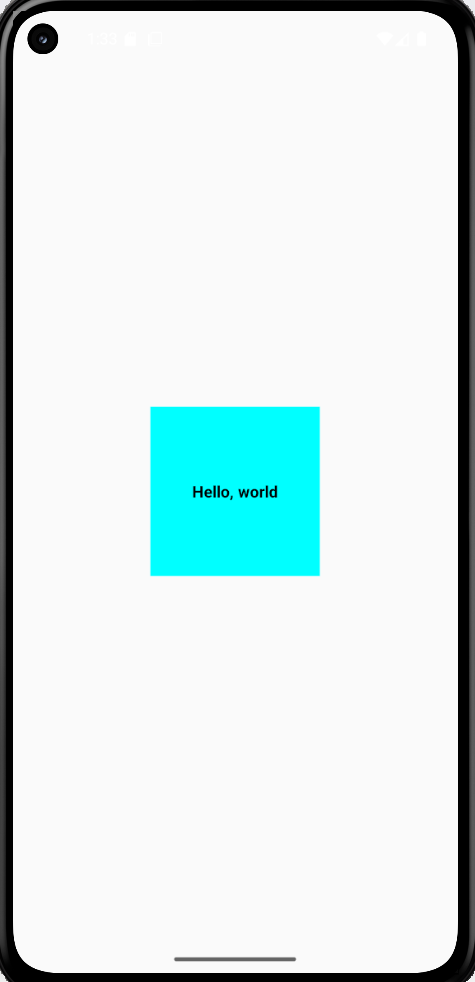

# BÁO CÁO BÀI TẬP BUỔI 3: CUSTOM COMPONENTS

## 1. Thông tin sinh viên
* **Họ và tên:** Lê Đức Tài
* **Mã sinh viên:** 23810310296
* **Lớp:** D18CNPM4

## 2. Nội dung bài làm
### Bài tập 3.1: Tạo Custom Component (Hình vuông)
**Yêu cầu:** - Render một hình vuông có màu nền.
- Hiển thị chữ "Hello, world" ở giữa.
- Sử dụng StyleSheet và Props.

**Cách thực hiện:**
- Đã tạo component `Square` riêng biệt.
- Sử dụng `Flexbox` để căn giữa nội dung.

## 3. Kết quả Demo
Ảnh chạy trên máy ảo Android:

